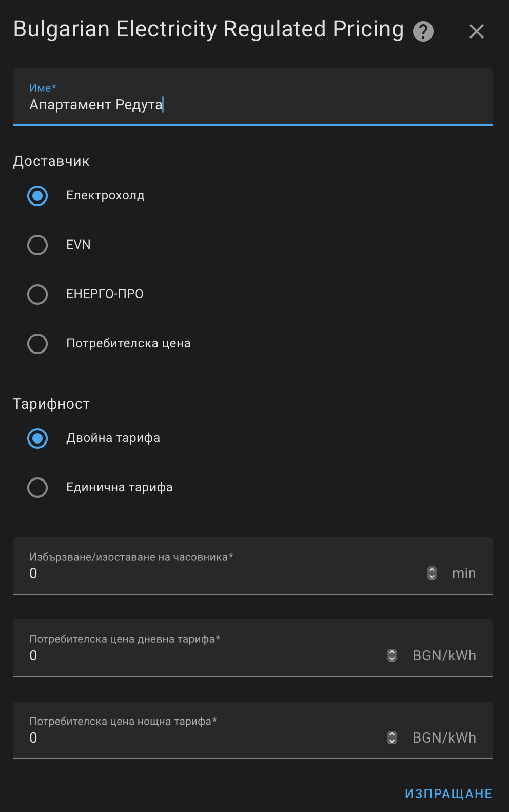
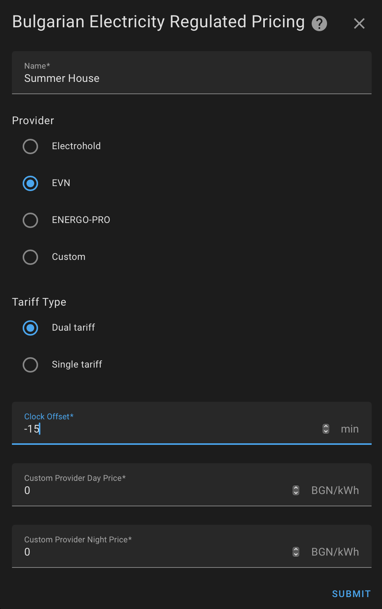

# Bulgarian Electricity Regulated Pricing for Home Assistant

Custom integration for [Home Assistant](https://www.home-assistant.io) that provides the price of electricity on the regulated market for domestic customers.

The integration provides two sensors that adjust according to the time of day and the configuration:

* Current price in BGN per kWh
* Current tariff (day or night)

All three global providers, Electrohold, EVN and ENERGO-PRO are supported.

The prices are defined statically as they change only about once a year. The official source for the current prices is section 6 from [Resolution C-14/30.06.2023 of the Bulgarian Energy and Water Regulatory Commission](https://www.dker.bg/uploads/reshenia/2023/res_c_14_23.pdf).

## Install

At present the only way to install the integration is to copy the [custom_components/bg_electricity_regulated_pricing](custom_components/bg_electricity_regulated_pricing) folder to your Home Assistant's custom_components folder just like with any other manually installed custom integration.

In the future, this integration may be added to HACS.

## Configuration

Search for the integration by name (Bulgarian Electricity Regulated Pricing). To configure it for most users, it will suffice to choose the provider.

|  |  |
|------------------------------|------------------------------|

### Advanced options

* Custom provider / Доставчик Потребителска цена - choose this to define custom prices for the day and night tariff below.
* Clock offset / Избързване/изоставане на часовника - this is the offset of the actual clock used to switch your tariff. For example, if your clock is 30 minutes ahead set it to 30; if it's 15 minutes behind set it to -15.
* Tariff Type / Тарифност - most users get billed at a dual tariff with separate day/night prices. If you're billed at a single tariff (the day price) choose single here.
